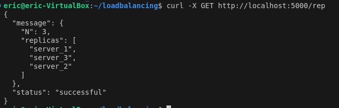
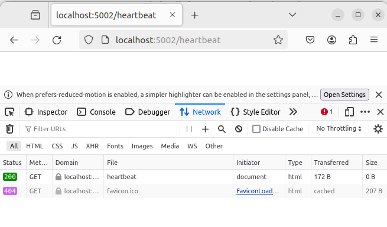
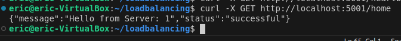
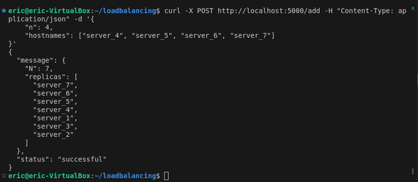
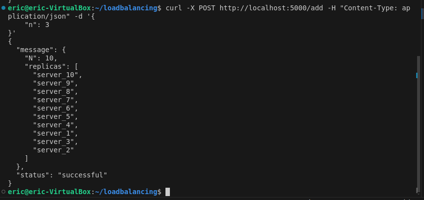
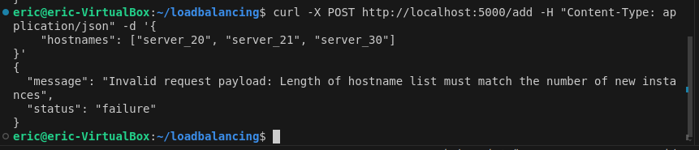
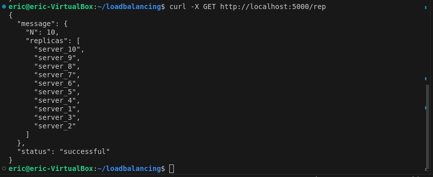
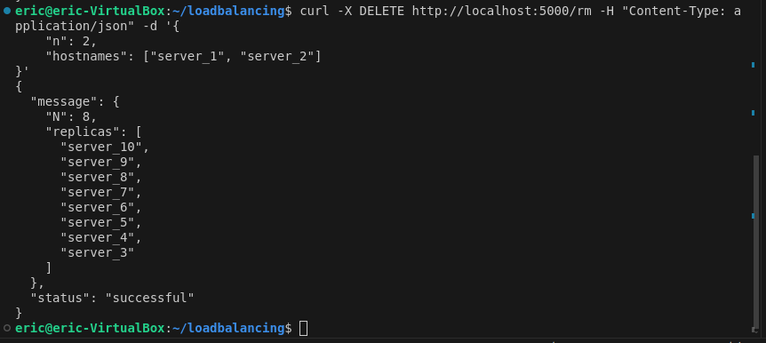
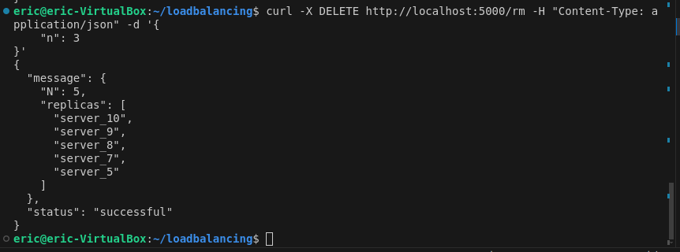

# Load Balancer Project

## Design Choices

- **load_balancer/**: Contains the load balancer application files.
- **myserver/**: Contains server application files used by the load balancer.
- **docker-compose.yml**: Defines Docker services for load balancer and server instances.
- **Makefile**: Provides convenient commands for Docker operations.
- **Flask**: Chosen for its lightweight and easy-to-use framework for building the load balancer and server applications.
- **Consistent Hashing**: Implemented for server selection based on request characteristics, ensuring even distribution of load.
- **Docker**: Utilized for containerization, ensuring consistent deployment environments across different machines. 
- The containers created and added are in the same network environment for efficient communication e.g dynamic addition and removal of containers.

## Assumptions

- **Single Load Balancer**: The setup assumes a single load balancer instance handling all incoming requests.
- **Request Testing Endpoint**: Assumes testing the load balancer with requests to `http://localhost:5000/home` using different request IDs to verify load balancing functionality.
- **Development Environment**: Designed for development and testing purposes.

## Usage

### Prerequisites

- Docker Engine installed on the host machine.

### Building and Running

1. **Build Docker Images:**
```bash
   make build 
```
2. **Start Services:**
```bash
   make build
```
3. **Access Load Balancer**
- To check server replicas
```bash
    curl -X GET http://localhost:5000/rep
```
- To check heartbeat for server e.g. server1
```bash
    curl -X GET http://localhost:5001/heartbeat
```
- To add server e.g 3 servers
```bash
    curl -X POST http://localhost:5000/add     -H "Content-Type: application/json"     -d '{"n": 3}'
```
- To remove server e.g 1 server
```bash
   curl -X DELETE http://localhost:5000/rm     -H "Content-Type: application/json"     -d '{"n": 1}'
```
## Testing and Performance Analysis

1. **/rep endpoint `http://localhost:5000/rep`** 



2. **/heartbeat endpoint e.g for server at `http://localhost:5002/hearbeat` server_2**



3. **/home endpoint e.g for server at  `http://localhost:5001/home` server_1**



4. **/add endpoint**
- provide the n field and a list of hostnames e.g adding 4:
``` bash
    curl -X POST http://localhost:5000/add -H "Content-Type: application/json" -d '{
    "n": 4,
    "hostnames": ["server_4", "server_5", "server_6", "server_7"]
}'
```


- If no provide hostnames, they are generated automatically based on the number n e.g adding 3 servers:

``` bash
    curl -X POST http://localhost:5000/add -H "Content-Type: application/json" -d '{
    "n": 3
}'
```


- To simulate an *error* where the n field is missing in the JSON payload:

``` bash
    curl -X POST http://localhost:5000/add -H "Content-Type: application/json" -d '{
    "hostnames": ["server_20", "server_21", "server_30"]
}'
```


- confirm the replicas in the server after adding processes



5. **/rem endpoint**
- provide the n field and a list of hostnames to remove e.g. server_1 and server_2:
``` bash
    curl -X DELETE http://localhost:5000/rm -H "Content-Type: application/json" -d '{
    "n": 2,
    "hostnames": ["server_1", "server_2"]
}'
```


- No hostnames, they should be selected randomly to be removed e.g 3:
``` bash
    curl -X DELETE http://localhost:5000/rm -H "Content-Type: application/json" -d '{
    "n": 3
}'
```


